# Amazon eCommerce System - UML Class Diagram

## Entities

* User (Base class)
* Product (with concurrent inventory management)
* Order
* OrderItem
* ShoppingCart
* OnlineShoppingService (Singleton)
* OrderNotificationManager

## Design Patterns

* **Singleton Pattern** - OnlineShoppingService
* **Strategy Pattern** - DiscountStrategy (PercentageDiscount, FixedAmountDiscount, BuyOneGetOneDiscount), Payment (CreditCardPayment, PayPalPayment)
* **Observer Pattern** - OrderObserver (EmailNotificationService, SMSNotificationService, InventoryUpdateService)
* **Factory Pattern** - ProductFactory (ElectronicsFactory, ClothingFactory, BooksFactory)

```mermaid
classDiagram
    class User {
        - String userId
        - String name, email, password
        - List~Order~ orders
        + getUserId() String
        + addOrder(Order order) void
    }
    
    class Product {
        - String productId
        - String name, description
        - double price
        - AtomicInteger quantity
        + reserveItems(int count) boolean
        + releaseItems(int count) void
        + isAvailable() boolean
        + updateQuantity(int newQuantity) boolean
    }
    
    class Order {
        - String orderId
        - User user
        - List~OrderItem~ orderItems
        - double totalAmount
        - OrderStatus status
        + addOrderItem(OrderItem item) void
        + setStatus(OrderStatus status) void
        + calculateTotalAmount() void
    }
    
    class OrderItem {
        - Product product
        - int quantity
        - double totalPrice
        + getProduct() Product
        + getQuantity() int
        + getTotalPrice() double
    }
    
    class ShoppingCart {
        - String userId
        - Map~String, OrderItem~ items
        + addItem(Product product, int quantity) void
        + removeItem(String productId) void
        + updateQuantity(String productId, int quantity) void
        + clearCart() void
        + getTotalAmount() double
    }
    
    class OnlineShoppingService {
        <<Singleton>>
        - static OnlineShoppingService instance
        - Map~String, User~ users
        - Map~String, Product~ products
        - Map~String, ShoppingCart~ userCarts
        - ReentrantReadWriteLock lock
        + getInstance() OnlineShoppingService
        + registerUser(User user) void
        + addProduct(Product product) void
        + searchProducts(String keyword) List~Product~
        + placeOrder(String userId, Payment payment) Order
        + addToCart(String userId, String productId, int quantity) void
    }
    
    class DiscountStrategy {
        <<interface>>
        + applyDiscount(double originalPrice, int quantity) double
        + getDiscountDescription() String
    }
    
    class PercentageDiscount {
        - double percentage
        + applyDiscount(double originalPrice, int quantity) double
        + getDiscountDescription() String
    }
    
    class FixedAmountDiscount {
        - double discountAmount
        + applyDiscount(double originalPrice, int quantity) double
        + getDiscountDescription() String
    }
    
    class BuyOneGetOneDiscount {
        + applyDiscount(double originalPrice, int quantity) double
        + getDiscountDescription() String
    }
    
    class Sale {
        - String saleId
        - String name
        - DiscountStrategy discountStrategy
        - boolean isActive
        + calculateDiscountedPrice(double originalPrice, int quantity) double
        + getDiscountDescription() String
        + activateSale() void
        + deactivateSale() void
    }
    
    class Payment {
        <<interface>>
        + processPayment(double amount) boolean
        + getPaymentDetails() String
    }
    
    class CreditCardPayment {
        - String cardNumber, expiryDate, cvv
        + processPayment(double amount) boolean
        + getPaymentDetails() String
    }
    
    class PayPalPayment {
        - String email
        + processPayment(double amount) boolean
        + getPaymentDetails() String
    }
    
    class OrderObserver {
        <<interface>>
        + onOrderStatusChanged(Order order, OrderStatus newStatus) void
    }
    
    class EmailNotificationService {
        + onOrderStatusChanged(Order order, OrderStatus newStatus) void
    }
    
    class SMSNotificationService {
        + onOrderStatusChanged(Order order, OrderStatus newStatus) void
    }
    
    class InventoryUpdateService {
        + onOrderStatusChanged(Order order, OrderStatus newStatus) void
    }
    
    class OrderNotificationManager {
        - List~OrderObserver~ observers
        - ExecutorService notificationExecutor
        + addObserver(OrderObserver observer) void
        + removeObserver(OrderObserver observer) void
        + notifyOrderStatusChange(Order order, OrderStatus newStatus) void
    }
    
    class ProductFactory {
        <<abstract>>
        + createProduct(String productId, String name, String description, double price, int quantity) Product
        + getFactory(ProductType type) ProductFactory
    }
    
    class ElectronicsFactory {
        + createProduct(String productId, String name, String description, double price, int quantity) Product
    }
    
    class ClothingFactory {
        + createProduct(String productId, String name, String description, double price, int quantity) Product
    }
    
    class BooksFactory {
        + createProduct(String productId, String name, String description, double price, int quantity) Product
    }
    
    class ElectronicsProduct {
        - String warranty, brand
        + setWarranty(String warranty) void
        + setBrand(String brand) void
    }
    
    class OrderStatus {
        <<enumeration>>
        PENDING
        PROCESSING
        SHIPPED
        DELIVERED
        CANCELLED
    }
    
    %% Relationships
    User --> Order : has
    Order --> OrderItem : contains
    OrderItem --> Product : references
    ShoppingCart --> OrderItem : contains
    Order --> OrderStatus : uses
    
    OnlineShoppingService --> User : manages
    OnlineShoppingService --> Product : manages
    OnlineShoppingService --> ShoppingCart : manages
    OnlineShoppingService --> Order : creates
    
    DiscountStrategy <|.. PercentageDiscount
    DiscountStrategy <|.. FixedAmountDiscount
    DiscountStrategy <|.. BuyOneGetOneDiscount
    Sale --> DiscountStrategy : uses
    
    Payment <|.. CreditCardPayment
    Payment <|.. PayPalPayment
    
    OrderObserver <|.. EmailNotificationService
    OrderObserver <|.. SMSNotificationService
    OrderObserver <|.. InventoryUpdateService
    OrderNotificationManager --> OrderObserver : notifies
    
    ProductFactory <|-- ElectronicsFactory
    ProductFactory <|-- ClothingFactory
    ProductFactory <|-- BooksFactory
    Product <|-- ElectronicsProduct
    ProductFactory --> Product : creates
```

## Key Architectural Components

### Core Entities
- **User**: Customer with order history
- **Product**: Thread-safe inventory management using AtomicInteger
- **Order**: Contains multiple order items with status tracking
- **ShoppingCart**: Concurrent cart operations using ConcurrentHashMap

### Management Layer
- **OnlineShoppingService**: Singleton managing all core operations with thread-safety
- **OrderNotificationManager**: Async notification system for order status changes

### Strategy Implementations
- **Discount**: Percentage, Fixed Amount, Buy-One-Get-One strategies
- **Payment**: Credit Card, PayPal payment processing

### Factory Pattern
- **ProductFactory**: Creates different product types (Electronics, Clothing, Books)
- **Specialized Products**: ElectronicsProduct with warranty and brand info

### JavaConcepts.Concurrency Features
- Thread-safe collections (ConcurrentHashMap, AtomicInteger)
- Read-write locks for search operations
- Synchronized methods for critical operations
- Async observer notifications