# Ride Sharing System - UML Class Diagram

## Entities

* User (Base class)
* Driver (extends User)
* Rider (extends User)
* Ride
* Location
* Vehicle
* Payment
* RideManager (Singleton)
* DriverLocationManager (Singleton)
* RideService
* LocationService

## Design Patterns

* **Singleton Pattern** - RideManager, DriverLocationManager
* **Strategy Pattern** - PricingStrategy (EconomyPricing, SurgePricing), DriverMatchingStrategy (NearestDriverMatcher, RatingBasedMatcher, RouteBasedMatcher)
* **Observer Pattern** - RideObserver (RideNotificationService, RideTrackingService)
* **Factory Pattern** - DriverMatcherFactory
* **Command Pattern** - RideCommand (AcceptRideCommand)

```mermaid
classDiagram
    class User {
        - String userId
        - String name, email, phone
        - Location currentLocation
        - UserType type
        - double rating
    }
    
    class Driver {
        - String licenseNumber
        - Vehicle vehicle
        - DriverStatus status
        - List~String~ acceptedRideTypes
    }
    
    class Rider {
        - PaymentMethod defaultPayment
        - List~Ride~ rideHistory
    }
    
    class Ride {
        - String rideId
        - Rider rider
        - Driver driver
        - Location source, destination
        - RideType type
        - RideStatus status
        - double fare
        - LocalDateTime createdAt, startTime, endTime
        + getTripId() String
        + displayTripDetails() void
    }
    
    class Location {
        - double latitude, longitude
        - String address
        + getLatitude() double
        + getLongitude() double
        + getAddress() String
    }
    
    class Vehicle {
        - String vehicleId, plateNumber
        - VehicleType type
        - String model, color
        + getVehicleDetails() String
    }
    
    class RideManager {
        <<Singleton>>
        - static RideManager instance
        - ConcurrentHashMap~String, Ride~ activeRides
        - ReentrantReadWriteLock lock
        + getInstance() RideManager
        + addRide(Ride ride) void
        + getRide(String rideId) Ride
        + getAllActiveRides() List~Ride~
    }
    
    class DriverLocationManager {
        <<Singleton>>
        - static DriverLocationManager instance
        - ConcurrentHashMap~String, Location~ driverLocations
        - ScheduledExecutorService locationUpdateExecutor
        + getInstance() DriverLocationManager
        + updateDriverLocation(String driverId, Location location) void
        + getAllDriverLocations() Map~String, Location~
    }
    
    class PricingStrategy {
        <<interface>>
        + calculateFare(Ride ride, double distance) double
    }
    
    class EconomyPricing {
        + calculateFare(Ride ride, double distance) double
    }
    
    class SurgePricing {
        - double surgeMultiplier
        + calculateFare(Ride ride, double distance) double
    }
    
    class PricingContext {
        - PricingStrategy strategy
        + setStrategy(PricingStrategy strategy) void
        + calculatePrice(Ride ride, double distance) double
    }
    
    class DriverMatchingStrategy {
        <<interface>>
        + findDriver(Ride ride, List~Driver~ availableDrivers) Driver
    }
    
    class NearestDriverMatcher {
        + findDriver(Ride ride, List~Driver~ drivers) Driver
        - calculateDistance(Location loc1, Location loc2) double
    }
    
    class RatingBasedMatcher {
        + findDriver(Ride ride, List~Driver~ drivers) Driver
    }
    
    class DriverMatcherFactory {
        + getMatchingStrategy(RideType type) DriverMatchingStrategy
    }
    
    class RideObserver {
        <<interface>>
        + onRideStatusChanged(Ride ride) void
    }
    
    class RideNotificationService {
        + onRideStatusChanged(Ride ride) void
        - sendNotification(String message) void
    }
    
    class RideSubject {
        - List~RideObserver~ observers
        - ExecutorService notificationExecutor
        + addObserver(RideObserver observer) void
        + removeObserver(RideObserver observer) void
        + notifyObservers(Ride ride) void
    }
    
    class RideService {
        - DriverMatchingService matchingService
        - PricingContext pricingContext
        - RideSubject rideSubject
        - RideManager rideManager
        - Semaphore rideRequestSemaphore
        + requestRide(Rider rider, Location source, Location destination, RideType type) CompletableFuture~Ride~
        + completeRide(String rideId) void
        + cancelRide(String rideId) void
    }
    
    class LocationService {
        - DriverLocationManager locationManager
        - ExecutorService locationProcessingExecutor
        - Cache~String, List~Driver~~ nearbyDriversCache
        + updateDriverLocation(String driverId, Location location) void
        + getNearbyDrivers(Location location, double radiusKm) CompletableFuture~List~Driver~~
    }
    
    %% Relationships
    User <|-- Driver
    User <|-- Rider
    Driver --> Vehicle
    Rider --> Ride
    Ride --> Location
    Ride --> Driver
    Ride --> Rider
    
    RideManager --> Ride
    DriverLocationManager --> Location
    
    PricingStrategy <|.. EconomyPricing
    PricingStrategy <|.. SurgePricing
    PricingContext --> PricingStrategy
    
    DriverMatchingStrategy <|.. NearestDriverMatcher
    DriverMatchingStrategy <|.. RatingBasedMatcher
    DriverMatcherFactory --> DriverMatchingStrategy
    
    RideObserver <|.. RideNotificationService
    RideSubject --> RideObserver
    
    RideService --> RideManager
    RideService --> PricingContext
    RideService --> RideSubject
    LocationService --> DriverLocationManager
```

## Key Architectural Components

### Core Entities
- **User**: Base class with common attributes
- **Driver/Rider**: Specialized user types with specific properties
- **Ride**: Central entity representing a trip request/booking
- **Location**: Geographic coordinates and address information

### Management Layer
- **RideManager**: Singleton managing all active rides with thread-safety
- **DriverLocationManager**: Singleton tracking driver locations in real-time

### Strategy Implementations
- **Pricing**: Economy vs Surge pricing algorithms
- **Driver Matching**: Nearest, Rating-based, Route-based matching

### Service Layer
- **RideService**: Core business logic for ride operations
- **LocationService**: Optimized location tracking with caching

### JavaConcepts.Concurrency Features
- Thread-safe collections (ConcurrentHashMap)
- Async processing (CompletableFuture, ExecutorService)
- Rate limiting (Semaphore)
- Caching (Caffeine cache)