# UML Class Diagram - Ride Sharing System

```mermaid
classDiagram
    %% Enums
    class UserType {
        <<enumeration>>
        RIDER
        DRIVER
    }
    
    class DriverStatus {
        <<enumeration>>
        AVAILABLE
        BUSY
        OFFLINE
    }
    
    class RideType {
        <<enumeration>>
        ECONOMY
        PREMIUM
        SHARED
    }
    
    class RideStatus {
        <<enumeration>>
        REQUESTED
        ACCEPTED
        IN_PROGRESS
        COMPLETED
        CANCELLED
    }
    
    class VehicleType {
        <<enumeration>>
        SEDAN
        SUV
        HATCHBACK
    }
    
    class PaymentMethod {
        <<enumeration>>
        CASH
        CARD
        WALLET
    }
    
    class PaymentStatus {
        <<enumeration>>
        PENDING
        COMPLETED
        FAILED
    }
    
    %% Core Entity Classes
    class User {
        - String userId
        - String name
        - String email
        - String phone
        - Location currentLocation
        - UserType type
        - double rating
    }
    
    class Driver {
        - String licenseNumber
        - Vehicle vehicle
        - DriverStatus status
        - List~String~ acceptedRideTypes
    }
    
    class Rider {
        - PaymentMethod defaultPayment
        - List~Ride~ rideHistory
    }
    
    class Ride {
        - String rideId
        - Rider rider
        - Driver driver
        - Location source
        - Location destination
        - RideType type
        - RideStatus status
        - double fare
        - LocalDateTime createdAt
        - LocalDateTime startTime
        - LocalDateTime endTime
    }
    
    class Location {
        - double latitude
        - double longitude
        - String address
    }
    
    class Vehicle {
        - String vehicleId
        - String plateNumber
        - VehicleType type
        - String model
        - String color
    }
    
    class Payment {
        - String paymentId
        - double amount
        - PaymentMethod method
        - PaymentStatus status
    }
    
    %% Singleton Pattern Classes
    class RideManager {
        <<Singleton>>
        - static volatile RideManager instance
        - ConcurrentHashMap~String, Ride~ activeRides
        - ReentrantReadWriteLock lock
        - RideManager()
        + static getInstance() RideManager
        + addRide(Ride ride) void
        + getRide(String rideId) Ride
    }
    
    class DriverLocationManager {
        <<Singleton>>
        - static volatile DriverLocationManager instance
        - ConcurrentHashMap~String, Location~ driverLocations
        - ScheduledExecutorService locationUpdateExecutor
        - DriverLocationManager()
        + static getInstance() DriverLocationManager
        + updateDriverLocation(String driverId, Location location) void
        - notifyNearbyRiders(String driverId, Location location) void
    }
    
    %% Strategy Pattern - Pricing
    class PricingStrategy {
        <<interface>>
        + calculateFare(Ride ride, double distance) double
    }
    
    class EconomyPricing {
        + calculateFare(Ride ride, double distance) double
    }
    
    class SurgePricing {
        - double surgeMultiplier
        + calculateFare(Ride ride, double distance) double
    }
    
    class PricingContext {
        - PricingStrategy strategy
        + setStrategy(PricingStrategy strategy) void
        + calculatePrice(Ride ride, double distance) double
    }
    
    %% Observer Pattern
    class RideObserver {
        <<interface>>
        + onRideStatusChanged(Ride ride) void
    }
    
    class RideNotificationService {
        + onRideStatusChanged(Ride ride) void
    }
    
    class RideTrackingService {
        + onRideStatusChanged(Ride ride) void
    }
    
    class RideSubject {
        - CopyOnWriteArrayList~RideObserver~ observers
        - ExecutorService notificationExecutor
        + addObserver(RideObserver observer) void
        + removeObserver(RideObserver observer) void
        + notifyObservers(Ride ride) void
        + shutdown() void
    }
    
    %% Factory Pattern - Driver Matching
    class DriverMatchingStrategy {
        <<interface>>
        + findDriver(Ride ride, List~Driver~ availableDrivers) Driver
    }
    
    class NearestDriverMatcher {
        + findDriver(Ride ride, List~Driver~ drivers) Driver
        - calculateDistance(Location loc1, Location loc2) double
    }
    
    class RatingBasedMatcher {
        + findDriver(Ride ride, List~Driver~ drivers) Driver
    }
    
    class RouteBasedMatcher {
        + findDriver(Ride ride, List~Driver~ drivers) Driver
    }
    
    class DriverMatcherFactory {
        + static getMatchingStrategy(RideType type) DriverMatchingStrategy
    }
    
    %% Command Pattern
    class RideCommand {
        <<interface>>
        + execute() void
        + undo() void
    }
    
    class AcceptRideCommand {
        - Ride ride
        - Driver driver
        + AcceptRideCommand(Ride ride, Driver driver)
        + execute() void
        + undo() void
    }
    
    class RideCommandInvoker {
        - ConcurrentLinkedDeque~RideCommand~ commandHistory
        - ReentrantLock commandLock
        + executeCommand(RideCommand command) void
        + undoLastCommand() void
    }
    
    %% Service Classes
    class RideService {
        - DriverMatchingService matchingService
        - PricingContext pricingContext
        - RideSubject rideSubject
        - RideManager rideManager
        - Semaphore rideRequestSemaphore
        - ExecutorService rideProcessingExecutor
        + requestRide(Rider rider, Location source, Location destination, RideType type) CompletableFuture~Ride~
        + completeRide(String rideId) void
        + cancelRide(String rideId) void
        - calculateDistance(Location source, Location destination) double
    }
    
    class LocationService {
        - DriverLocationManager locationManager
        - ExecutorService locationProcessingExecutor
        - Cache~String, List~Driver~~ nearbyDriversCache
        + updateDriverLocation(String driverId, Location location) void
        + getNearbyDrivers(Location location, double radiusKm) CompletableFuture~List~Driver~~
        - calculateDistance(Location loc1, Location loc2) double
        - getDriverById(String driverId) Driver
    }
    
    class RideRequestException {
        + RideRequestException(String message, Throwable cause)
    }
    
    %% Relationships
    User <|-- Driver : extends
    User <|-- Rider : extends
    User --> UserType : uses
    Driver --> DriverStatus : uses
    Driver --> Vehicle : has
    Rider --> PaymentMethod : uses
    Rider --> Ride : has history
    
    Ride --> RideType : uses
    Ride --> RideStatus : uses
    Ride --> Location : has source/destination
    Ride --> Rider : belongs to
    Ride --> Driver : assigned to
    
    Vehicle --> VehicleType : uses
    Payment --> PaymentMethod : uses
    Payment --> PaymentStatus : uses
    
    RideManager --> Ride : manages
    DriverLocationManager --> Location : manages
    
    PricingStrategy <|.. EconomyPricing : implements
    PricingStrategy <|.. SurgePricing : implements
    PricingContext --> PricingStrategy : uses
    
    RideObserver <|.. RideNotificationService : implements
    RideObserver <|.. RideTrackingService : implements
    RideSubject --> RideObserver : notifies
    
    DriverMatchingStrategy <|.. NearestDriverMatcher : implements
    DriverMatchingStrategy <|.. RatingBasedMatcher : implements
    DriverMatchingStrategy <|.. RouteBasedMatcher : implements
    DriverMatcherFactory --> DriverMatchingStrategy : creates
    
    RideCommand <|.. AcceptRideCommand : implements
    RideCommandInvoker --> RideCommand : executes
    AcceptRideCommand --> Ride : modifies
    AcceptRideCommand --> Driver : modifies
    
    RideService --> RideManager : uses
    RideService --> PricingContext : uses
    RideService --> RideSubject : uses
    LocationService --> DriverLocationManager : uses
    
    RideService ..> RideRequestException : throws
```

## Design Pattern Summary

### 1. **Singleton Pattern**
- `RideManager`: Centralized ride management
- `DriverLocationManager`: Global location tracking

### 2. **Strategy Pattern**
- `PricingStrategy`: Flexible pricing algorithms
- `DriverMatchingStrategy`: Different matching algorithms

### 3. **Observer Pattern**
- `RideObserver`: Decoupled notifications for ride status changes
- Async processing to prevent blocking

### 4. **Factory Pattern**
- `DriverMatcherFactory`: Creates appropriate matching strategies based on ride type

### 5. **Command Pattern**
- `RideCommand`: Encapsulates ride operations with undo capability
- Thread-safe command history

### 6. **Dependency Injection**
- Services use composition for flexibility and testability

## Key Architectural Features

- **Thread Safety**: ConcurrentHashMap, locks, and thread-safe collections
- **Async Processing**: CompletableFuture and ExecutorService for non-blocking operations
- **Caching**: Caffeine cache for performance optimization
- **Rate Limiting**: Semaphore for controlling concurrent operations
- **Error Handling**: Custom exceptions and graceful failure handling